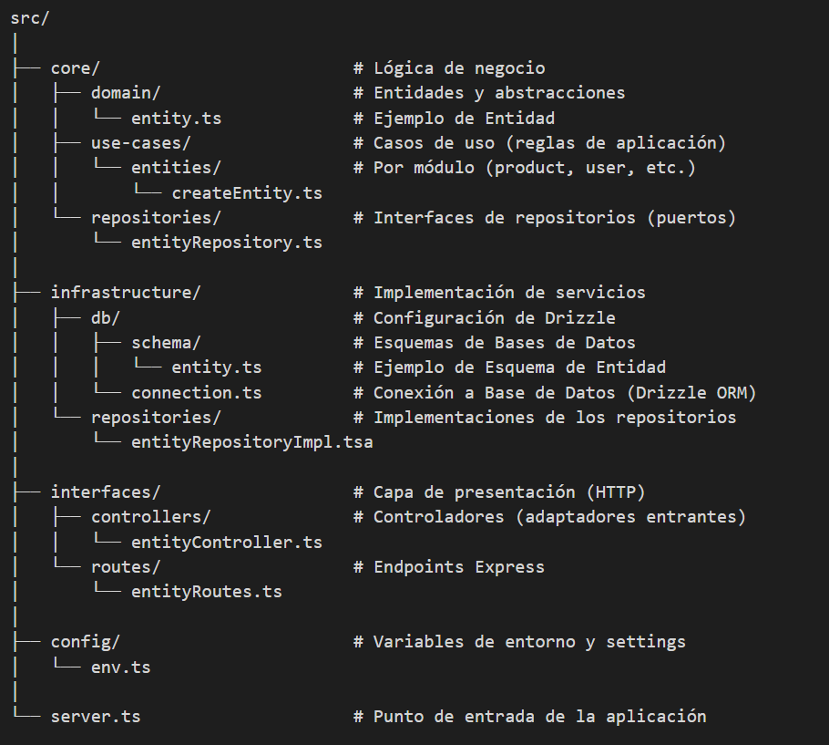

# API Clean Architecture - Backend - v1.0.0

Interfaz de Programación de Aplicaciones (API) desarrollada con un enfoque modular, mantenible y escalable, utilizando el patrón de diseño Repository y los principios de Clean Architecture. Este proyecto está pensado tanto para demostraciones como para pruebas de desarrollo, y está listo para ser desplegado en entornos de producción.

## Descripción

Esta API sirve como base para el desarrollo de aplicaciones que requieren una capa backend robusta, orientada a la gestión y análisis de datos. Está diseñada para ser altamente desacoplada y testeable, ideal para entornos con necesidad de crecimiento modular o integración continua.

- Registrar y rastrear entidades con información detallada.
- Gestionar datos estructurados a través de operaciones CRUD
- Realizar análisis de datos con posibilidad de extender a estadísticas o KPIs.
- Generar informes y visualizaciones.
- Programar y realizar tareas o mantenimientos asociados.
- Diseñada para ejecución en contenedores (Docker) y entornos de nube.

## Estructura del Proyecto API Clean Architecture

## Tecnologías

### Node.js
Entorno de ejecución JavaScript en el servidor.

### Express
Framework HTTP rápido y minimalista.

### TypeScript
Tipado estático para mayor robustez del código.

### Drizzle ORM
ORM ligero y seguro, orientado a SQL declarativo.

### PostgreSQL
Motor de base de datos relacional confiable y escalable.

### Dotenv
Gestión de configuración mediante variables de entorno.

### Clean Architecture
Patrón arquitectónico que desacopla capas y facilita testing.

### Repository Pattern
Abstracción de la capa de persistencia para desacoplar la lógica de negocio.

### Docker Ready
Estructura preparada para contenedores y despliegue en la nube. Próximamente disponible.

## 🚀 Estado del proyecto

✅ Listo para integración en proyectos reales o pruebas de concepto.

🔧 Fácilmente adaptable a nuevas entidades o servicios.

📦 Preparado para ser contenedorizado y desplegado en producción.

### Ejemplo de caso de uso (flujo típico)
1) Cliente HTTP --> Route --> Controller --> UseCase

2) UseCase --> Repository Interface --> Repository

3) Repository  --> Implementation --> Databases

## Author: Joaquin Antonio Galdame

### University technician in programming. Full Stack Web Developer